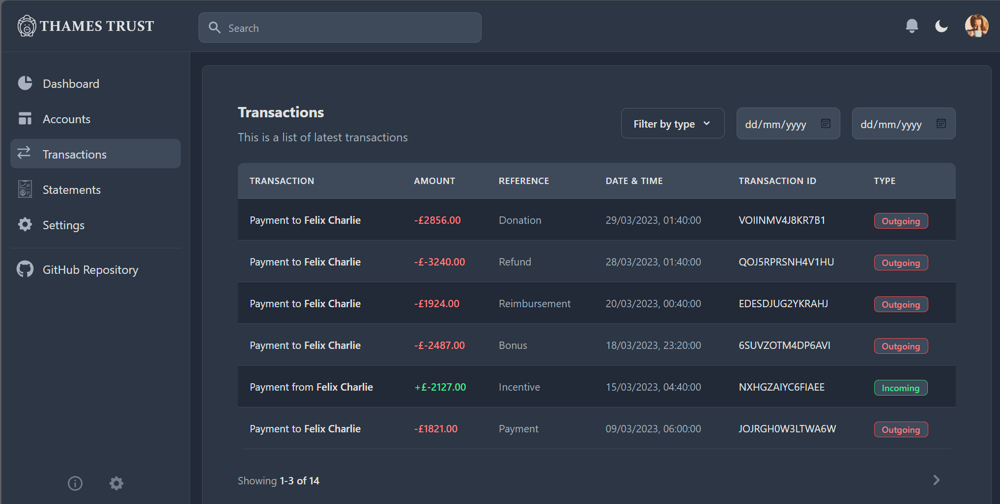

# Thames Trust - Bank Simulation Application

## What's Thames Trust app?

Thames Trust is a React application that simulates an online banking, which is tailored for individuals and business.

## Deployed Application

The deployed application is available at [https://thames-trust.netlify.app/](https://thames-trust.netlify.app/).

## Table of Contents
* [Tech Stack](#tech-stack)
* [APIs](#apis)
* [Installation](#installation)
* [Usage](#usage)
* [Features](#features)
* [Limitations](#limitations)
* [Contributors](#contributors)
* [Credit](#credit)
* [License](#license)

## Tech Stack
### Dependencies:
* react: "^18.2.0",
* react-router-dom: "^6.22.3",
* clsx: "^2.1.0",
* match-sorter": "^6.3.4",
* react-toggle-dark-mode: "^1.1.1",
* regex-to-strings: "^2.1.0",
* tailwind-merge: "^2.2.1"

### Dev Dependencies
* vite: "^5.1.4",
* vitest: "^1.3.1"
* tailwindcss: "^3.4.1",
* prettier-plugin-tailwindcss: "^0.5.11",
* postcss: "^8.4.35",
* prettier: "^3.2.5",
* autoprefixer: "^10.4.18",
* eslint: "^8.56.0",

### CSS Component Library

* [Flowbite](https://flowbite.com/docs/getting-started/introduction/)
* [Flowbite Admin Dashboard](https://github.com/themesberg/flowbite-admin-dashboard)

## APIs
The app does not use any API at the moment.

## Installation
The app is a Vite React application. Run `npm i` and then `npm run dev` to run it locally or visit [https://thames-trust.netlify.app/](https://thames-trust.netlify.app/) to test the app. See the Usage section below for further details.
## Usage
* The app utilises an initialisation process to populate its data. On the first launch, it loads  the data from json files in `src/data`. The data then is persisted to localStorage, and then the app finally renders the UI.
* Viewing home page is open to the public and does not require authentication. However, for account related activity the app on the dashboard, the requires authentication. Please use the following credentials to log in OR if you want to test with different users, you can get credential details from localStorage.
    * **Login Details**
        * `Email address`: demo@demo.com `Password`: 12345
* The app supports new user registration with each input being checked and validated. After the form is validated and user is saved, the app will authenticate the newly created user automatically.
* The app does not require any browser-related permissions.
## Features
* The app is organised by features - `dashboard`,`user`,`account`,`transaction`,`settings`,`statements`to ensure maintainability and scalability.
* The app implements user authentication, generates an authentication token, and saves it to sessionStorage
* The app implements user registration and supports form validation
* The app implements multiple use of useContext() in React to create contexts for each individual features. It accesses these contexts via custom hooks such as `useAccountContext`, `useUserContext`, `useTransactionContext`
* The app implements multiple customs hooks.
* The app uses React Router and layouts
* The app uses useMemo to cache filtered transactions
* The app uses CSS components from the Flowbite library and Flowbite Admin Dashboard but implements its own logic to control interactive elements programmatically
* The app has internal APIs/Methods to work with localStorage, implement authentication, and manage contexts. It borrows the naming convention from Spring Framework.
    * **[Entity Persistence Class](src/classes/EntityPersistence.js)**:
        * This API uses Map as the data structure
        * This API allows persisting data to and retrieving from localStorage.
        * This API generates sequential IDs while creating objects.
        * This API provides the following default methods:
          * `create()`: Creates an object and assign a sequential ID
          * `update()`: Updates an object - identical to `save()` but it is abstracted for clarity
          * `delete()`: Deletes an object
          * `saveAll()`: Saves an array object to the corresponding local storage key
          * `findById()`: Returns an object by ID 
          * `findAll()`: Returns an array of objects.
        * Entity Persistence is extended by three classes:
            * **User Repository**: This uses the key `users` in localStorage and extends the default Entity Persistence methods with the following to work with the `User` object:
                * `findUserByUsername()`: Finds and returns the user with the given username. Returns `false` if the user does not exist.
                * `findUserByEmail()`: Finds and returns the user with the given email address. Returns `false` if the user does not exist.
            * **Account Repository**: This uses the key `accounts` in localStorage and extends the default Entity Persistence methods with the following to work with the `Account` object:
                * `findAllAccountsByUser()`: Retrieves all accounts for the given users. `Returns` users.
                * `updateBalance()`: Update the balance in the given account
            * **Transaction Repository**: This uses the key `transactions` in localStorage and extends the default Entity Persistence methods with the following to work with the `Transaction` object:
                * `findAllTransactionsByUser`: Retrieves all transactions for the given user.
    * **[Authentication Class](/src/classes/Authentication.js)**
        * This API implements user authentication, generates a token, and saves it to sessionStorage.
        * The app supports user log-out, which clears the authentication token from sessionStorage.
        * This API has the following methods:
            * `getAuthenticationToken()`: Retrieves authentication token from sessionStorage. Returns `false` if `jwt-token` key does not exist in sessionStorage.
            * `isAuthenticated()`: Checks if a given user is authenticated. Returns `true` or `false`.
            * `isCredentialsCorrect()`: Checks if a given user's credentials are correct. Returns `true` or `false`.
            * `authenticateUser()`: Authenticates user, generates a token, and saves it to sessionStorage. Returns `authToken`.
            * `getAuthenticatedUserId()`: Returns the authenticated `userID
            * `getAuthenticatedUser()`: Returns the authenticated user
            * `logout()`: Logs out the authenticated user and clears sessionStorage. Returns `false`, if logout fails.
    * **[Application Context](/src/context)**
        * The app implements React contexts for state management.
        * The has the following context, which all have corresponding [custom hooks](/src/hooks) to consume them:
            * `UserContext`: Fetches initial `users` data and provides `users` and `setUsers` objects via `useUserContext` hook.
            * `AccountContext`: Fetches initial `accounts` data and provides `accounts` and `setAccounts` objects via `useAccountContext` hook.
            * `TransactionContext`: Fetches initial `transactions` data and provides `transactions` and `setTransactions` objects via `useTransactionContext` hook.
            * `AuthenticationPersistenceContext`: Provides `authentication` objects via `useAuthentication` hook.
            * `EntityPersistenceContext:` Provides `userRepository, transactionRepository, accountRepository` objects to access localStorage via `useLocalStorage` hook.
            * `ModalDrawerContext`: Sets states for modal and provides `isDrawerOpen` and `setIsDrawerOpen` variable via `useModalDrawerContext` hook.
## Limitations
* The app currently does not utilise statements, and settings routes
* The app requires more complex logic to address transaction requirements
* The app currently does not support displaying transactions by account
* The app currently sign-out requires a full browser refresh to hide user profile menu
##  Contributors
* [Becky Webster](https://github.com/bweb85)
* [Mate Panyor](https://github.com/mattpanyor)
* [Muhammet Keles](https://github.com/JBraddockm)
* [Prangchira Kewcharoenwong](https://github.com/prangchira)
* [Sameerah Khalid](https://github.com/The-real-sammy)

## Credit
* App logo, product icons, and other SVGs are from [SVG Repo](https://www.svgrepo.com/svg/429650/bank-business-tools-piggy-2)
## License
Please refer to the LICENSE in the repo.
